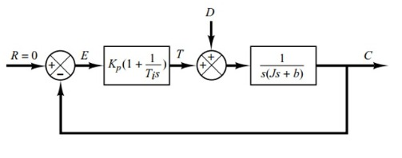
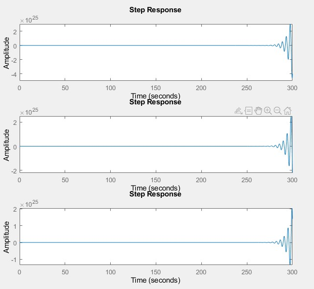
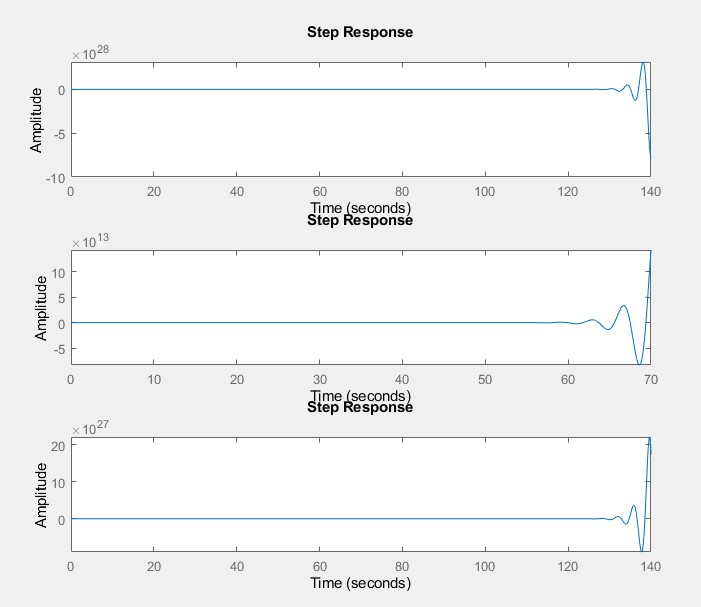
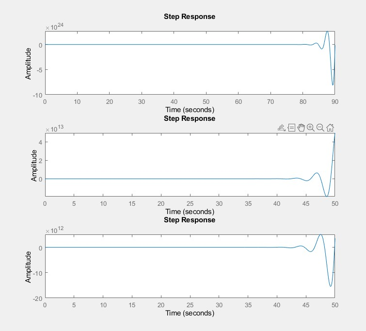
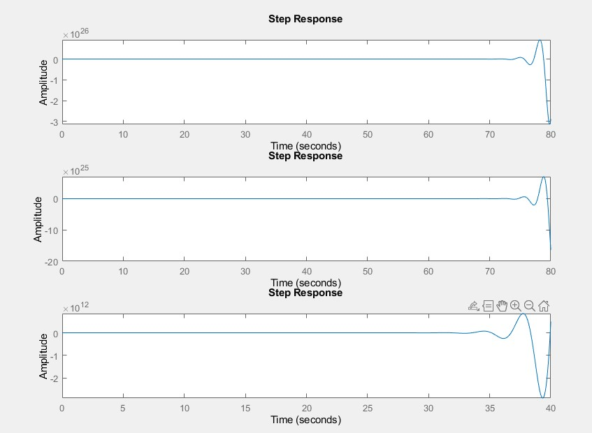
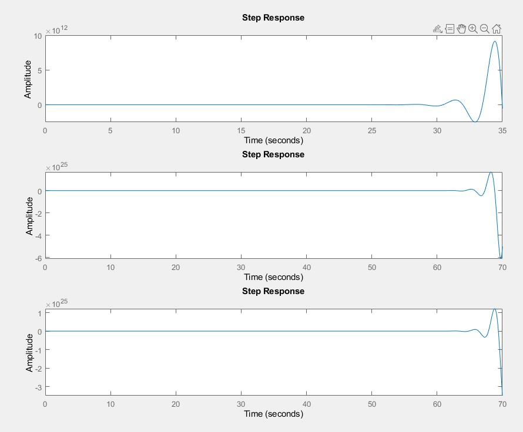

    %% declaration of system variable
    s = tf('s')
    T = 1
    Kp = 1;
    Ti = 1/5;
    Ki = Kp/Ti;
    num = 1;
    den = [T T/16 1];
    sys = tf(num,den);

variable variable dalam sistem kendali terdiri atas Ti,Kp,Ki,s merupakan konstanta,gain proporsional ,gain integral ,dan dimensi ruang laplace

berdasarkan fungsi PID diatas dapat dinyatakan bahwa KI = KP/Ti 

sehingga system control atau gain adalah : ((Kp*s)+Ki)/s
    sys_c = tf([Kp Ki],[1 0])

    %% output plant function
    complete = feedback(sys*sys_c,1)

    figure
    subplot(311), step(complete*s);   % Impulse reponse
    stepinfo(complete*s)
    subplot(312), step(complete);      % Step Response
    stepinfo(complete)
    subplot(313), step(complete / s);  % Ramp response 
    stepinfo(complete/s)

untuk hasil respon menggunakan impulse step dan ramp secara berurutan dengan variasi KI (1,3,5,7,9) sebagai berikut

KI= 1

KI= 3

KI= 5

KI= 7

KI= 9

